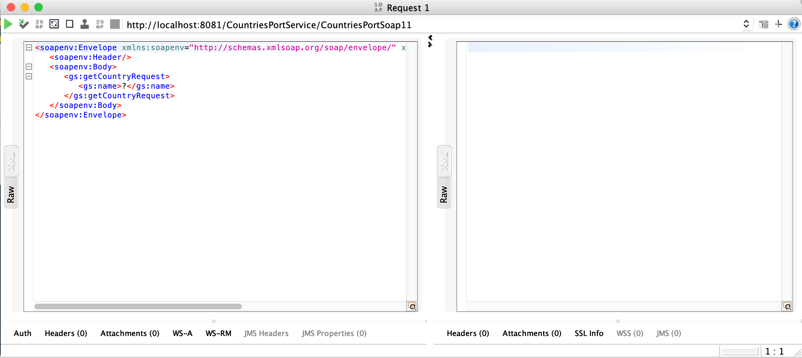

# Télécharger PDF

# Objectifs du TP
Création et consommation de web services SOAP en utilisant l'outil Anypoint Studio.

# Outils et Versions
* [Anypoint Studio 7 and Mule ESB 4](https://www.mulesoft.com/lp/dl/anypoint-mule-studio)
* [MySQL](https://dev.mysql.com/downloads/) Version _latest_
* [SOAPUI](https://www.soapui.org/downloads/soapui.html) (Open Source) Version 5.7.0
* [VSCode](https://code.visualstudio.com/Download) Version _latest_

# Présentation des outils 
## Anypoint Platform
[Anypoint](https://www.mulesoft.com/platform/enterprise-integration) est une plateforme développée par l’entreprise Mulesoft qui offre les outils nécessaires pour la gestion d’APIs et l'intégration de services. Grâce à Anypoint, Mulesoft est classée par Gartner dans son Magic Quadrant dans la rubrique “Enterprise Integration Platform as a Service” de Décembre 2022 parmi les leaders du marché.

## Mule ESB
Mule, le runtime engine d'Anypoint Platform, est un ESB (enterprise service bus) léger basé sur Java ainsi qu'une plateforme d'intégration qui permet aux développeurs de connecter des applications rapidement et facilement afin qu'elles puissent échanger des données. Cela facilite l'intégration des systèmes existants, quelles que soient les technologies utilisées par les applications, notamment JMS, Web Services, JDBC, HTTP, etc. Cet ESB, déployable n'importe où, qui intègre et orchestre les événements en temps réel ou par lots, dispose d'une connectivité universelle.

Mule ESB propose les services suivants:

  * Création et hébergement de services
  * Médiation de services
  * Routage des messages
  * Transformation des données

## Anypoint Studio
Anypoint Studio fournit une interface graphique de
développement pour implémenter, compiler, tester et publier des services Web, des services de données et des routes de messages.

<!-- # Création d'un service web SOAP avec Spring Boot et VSCode

Nous allons commencer par créer un premier service web simple, pour tester son déploiement et intégration sur l'ESB plus tard. Nous utilisons pour cela Spring Boot et VSCode (mais on aurait pu utiliser n'importe quel autre langage, framework ou IDE).

Ce web service permet de créer un service web SOAP avec Spring Boot, qui prend en entrée un pays (_Spain_, _Poland_ ou _United Kingdom_), et nous donne sa population, sa capitale et sa monnaie. Vous trouverez tous les détails et explications du code dans le tutoriel suivant: `https://spring.io/guides/gs/producing-web-service`.

* Commencer par cloner le repository git suivant : `https://github.com/spring-guides/gs-producing-web-service`
* Sur votre répertoire local, ouvrir le projet avec VSCode (ou tout autre IDE de votre choix).
* Je vous donne ici les étapes à suivre pour lancer le service avec Maven ([Maven 3.5+](https://maven.apache.org/download.cgi) est requis). Si vous préférez gradle, vous trouverez les détails d'exécution dans le tutoriel d'origine. 
  * Positionnez-vous sous le répertoire `complete`
  * Lancer votre service :
    * Si vous êtes sur Linux/Mac, exécuter la commande : `./mvnw spring-boot:run`
    * Si vous êtes sur Windows, exécuter : `mvnw.cmd spring-boot:run`

Si le service est correctement lancé, vous trouverez un affichage similaire au suivant:

Pour tester votre service, il est recommandé d'utiliser une application comme SOAPUI. Pour cela: 

* Vérifier que votre web service tourne bien et que votre WSDL est généré en tapant sur votre navigateur: `http://localhost:8080/ws/countries.wsdl`. Un WSDL devrait s'afficher correctement.
* Ouvrir SOAPUI et créer un nouveau projet SOAP.
* Lui donner un nom (par exemple _MySOAPService_) et un WSDL initial: `http://localhost:8080/ws/countries.wsdl`
* Cliquer sur _Request 1_ qui se trouve sous l'opération _getCountry_
* Une fenêtre s'affiche avec le fichier XML de la requête SOAP. Vous n'avez qu'à remplacer le ? par _Spain_, puis exécuter le web service. La réponse s'affichera sous la forme d'un fichier XML (SOAP Response) contenant les informations sur le pays donné en entrée, comme suit:

 -->

# Création d'un service web SOAP avec Anypoint Studio et Mule

Il est possible de créer un service web SOAP avec Anypoint en utilisant les connecteurs fournis, et très peu de lignes de code. Nous allons simuler le comportement du service web décrit dans le tutoriel suivant: `https://spring.io/guides/gs/producing-web-service`.

## 1. Exposition d'un service web SOAP à partir d'un fichier WSDL existant

Nous récupérons d'abord le fichier WSDL du service. Il est possible de générer un fichier WSDL avec des outils tel que Eclipse, mais nous allons nous contenter d'en utiliser un qui est prêt. Vous trouverez le fichier wsdl à télécharger ici : .

Le web service SOAP que nous allons créer prend en entrée un pays (nous accepterons pour le moment _Spain_ ou _Poland_), et nous donne sa population, sa capitale et sa monnaie. Nous allons suivre les étapes suivantes pour créer ce service avec Anypoint Studio. 

  * Créer un nouveau Mule Project, qu'on appellera TP1. Dans la fenêtre de création : 
    * Indiquer que le runtime est bien Mule Server 4.4.0
    * Installer le runtime supplémentaire suivant: _Anypoint APIkit SOAP Plugin_
    * Indiquer que le wsdl est le fichier que vous venez de télécharger. Pour cela, cliquer sur _"Import RAML from local file"_ et choisir le fichier wsdl. Vérifier que le service et le port s'affichent bien comme suit:

Une fois le projet créé, la fenêtre suivante va apparaître:

En cliquant sur **Listener**, vous pouvez trouver (en bas de l'écran) les informations de base du service SOAP exposé, qui est décrit par votre wsdl, tel qu'indiqué dans la figure suivante:

Le path (1), domaine et port (2) permettent de représenter l'URL du service qui sera exposé. Pour tester cela, lancer le service, en faisant un clic-droit sur la fenêtre principale, et en choisissant: _Run project tp1_.

!!! tip "Remarque"

    Prenez soin d'utiliser une version de JDK entre 8 et 12, car ce sont celles compatibles avec le serveur Mule 4.4.

Une fois le service lancé, vérifiez bien que le wsdl est exposé, sur l'URL: `http://localhost:8081/CountriesPortService/CountriesPortSoap11?wsdl`

## 2. Test du service web avec SOAP UI

Nous allons maintenant tester notre service web. Comme vous le savez certainement, pour tester un service web SOAP, il faut écrire une SOAP Request (en XML), pour obtenir un SOAP Response de la part du service. Pour cela, nous utilisons un outil de test léger, appelé SOAP UI. 

Lancer SOAP UI, et créer un nouveau projet SOAP. Ensuite:

  * Nommer le projet TP1 par exemple.
  * Coller l'URL du WSDL dans le champs _Initial WSDL_
  * Dans le projet créé, naviguer vers _TP1 -> CountriesPortSoap11 -> getCountry -> Request1_ et double cliquer dessus. Une fenêtre s'ouvre, comme suit:

  

Pour tester le service, il suffit de remplacer le **?** dans la balise <gs:name>?</gs:name> par le nom d'un pays, par exemple _Spain_. Lancer le service en cliquant sur la flèche verte. Que constatez-vous?

Bien entendu, rien ne va vraiment se passer, car le service n'a pas encore été implémenté. Tout ce qu'on a fait, c'est de donner une spécification vide. La réponse qui s'affiche est un fichier XML affichant une erreur semblable à la suivante: _Operation [getCountry:\soapkit-config] not implemented_.

Nous allons montrer dans ce qui suit comment corriger cette erreur, pour afficher les informations d'un pays donné en paramètre.

## 3. Implémentation du service

Le deuxième rectangle dans la fenêtre principale de Anypoint permet de définir le comportement du service suite à la réception d'un SOAP Request. Il contient pour le moment un seul composant : _Transform Message_. En cliquant dessus, vous retrouverez dans l'output le message d'erreur qui vous a été retourné précédemment. Ceci veut dire que le comportement du service n'a pas été implémenté.

Pour le faire, nous allons suivre les étapes suivantes:

  * Cliquer sur le composant _Transform Message_. Dans ses propriétés, trois colonnes sont affichées tel que représenté dans la figure suivante:

    - Input:  le squelette de la SOAP Request
    - Output (graphique): le squelette de la SOAP Response.
    - Output (code): le code XML correspondant à la SOAP Response.
  
  * Supprimer le bloc **Soap#Fault** du code XML. 
  * Glisser la variable **name** de l'Input vers la variable **name** de l'output graphique. Observez comment le code XML a également changé.
  * Double cliquer sur le champs **population** dans la colonne dde l'output graphique. Le code approprié sera généré dans le XML. Remplacer la valeur **null** par la valeur de la population en Espagne (47420000 à ce jour). Faites de même pour indiquer la capitale (_Madrid_) et la monnaie (_EUR_).

Le résultat devra ressembler à ce qui suit:

Relancer le service si vous l'avez fermé, et observez le résultat sur SOAPUI. Cela a l'air de bien marcher!

Cela dit, le service donnera toujours le même résultat (population/capitale/monnaie), quelque soit l'input saisi dans pays. Nous allons essayer dans ce qui suit de le rendre un peu plus flexible, toujours sans écrire une ligne de code!

## 4. Implémentation d'une condition

Pour implémenter une condition dans notre service, qui donne un output différent selon l'entrée qui lui est donnée, nous allons suivre les étapes suivantes:

  * Nous allons d'abord créer une variable _country_, qu'on va alimenter à partir de l'input. Pour cela:
    * Glisser le composant _Set Variable_ de la palette juste avant _Transform Message_
    * Donner le nom _country_ à la variable.
    * Dans le champ _Value_, cliquer sur le bouton .
    * Écrire quelque chose dans le champ qui s'affiche (par exemple _country_)
    * Cliquer ensuite sur le bouton  pour mapper l'entrée à la variable. 
    * Dans la fenêtre qui s'affiche, glisser l'élément _name_ de la requête vers la chaine String (dans l'output graphique). La valeur que vous avez saisi sera écrasée par l'expression du nom en entrée. 
    * Cliquer sur _Done_
  * À partir de la palette, glisser le composant _Choice_ avant _Transform Message_
  * Glisser ensuite _Transform Message_ dans le _When_ 
  * Cliquer sur le _When_ pour définir la condition.
    * Dans le champ _Expression_, cliquer sur le bouton , puis taper **directement** la condition: `vars.country == 'Spain'`
  * Pour ajouter une autre condition (un _else if_), glisser un nouveau _Transform Message_ de la palette vers l'extrémité droite du box _Choice_. Refaire ensuite les opérations précédentes pour un autre pays, tel que la Tunisie.
  * Dans le box _Default_, créer un message d'erreur qui ressemble à celui qu'on avait à la création du service, qui indique que le pays donné en entrée n'est pas pris en charge.

Lancer le service, et vérifier avec SOAPUI que toutes les conditions sont bien prises en compte.

!!! warning "Attention"

    Prenez des imprim-écrans dès que a marche, vous en aurez besoin dans le rapport!

# Consultation d'une base de données

Nous allons montrer dans ce qui suit les étapes nécessaires pour configurer et faire appel à une base de données. Nous allons utiliser MySQL dans notre exemple.

## 1. Création et population de la base

Pour cela:

  * Créer une nouvelle base de données avec MySQL. On l'appellera Countries.
  * Lancer le script SQL suivant pour créer la table countries populée avec plusieurs exemples de pays: 

Consulter votre base pour voir son contenu et sa structure.

## 2. Modification du flux

Modifier le flux _getCountry_ de façon à ce qu'il ressemble à l'image suivante:

  * **Set Variable** permet de créer une variable _country_ qui saisit l'entrée dans la SOAP Request.
  * **Logger** permet d'afficher le contenu de la variable saisie sur la console, sous la forme: _"Pays: <nom_pays\>"_.
  * **Select** contient la requête de sélection de la base de données, filtrée par le pays donné en entrée.
  * **Transform Message** retourne dans la SOAP Response, les informations du pays en entrée, extraites de la base de données.

Le résultat attendu ressemble au suivant:

# Projet

!!! note "Étape 1"
    Pour la séance de TP prochaine, vous devez réaliser l'étape 1 du projet, qui consiste à:
    
    * Trouver le concept de votre entreprise (nom, logo, métier, et départements)
    * Réaliser le tutoriel : Archisurance (voir les supports du projet)
    * Commencer à réaliser les diagrammes de votre propre entreprise.