# Télécharger PDF
[](tp2.pdf)

# Objectifs du TP
1. Génération d’API avec Anypoint API Designer et le langage RAML
2. Gestion des APIs avec Anypoint Studio et le API Gateway de Mulesoft

# Outils et Versions
* [Anypoint Studio 7 and Mule ESB 4](https://www.mulesoft.com/lp/dl/anypoint-mule-studio)
* [MySQL](https://dev.mysql.com/downloads/) Version _latest_
* Dans ce TP, nous aurons besoin du service SOAP créé dans le [TP1](tp1.md#service-web-rest--interrogation-dune-base-de-données).

# API Management avec Anypoint Studio


# Génération d'API avec RAML
## RAML
[RAML](https://raml.org/) (RESTful API Modeling Language) est un langage pour la définition d’API HTTP qui satisfont les exigences de l'architecture REST. La spécification RAML est une application de la spécification YAML, qui fournit des mécanismes pour la définition d’APIs RESTful.

RAML est développé et supporté par un groupe de leaders en nouvelles technologies, provenant de plusieurs entreprises éminentes (Mulesoft, Airware, Akana, VMware, CISCO…). Leur but est de construire une spécification ouverte, simple et succincte pour la description d’APIs. Ce groupe de travail contribue à la fois à la spécification RAML, ainsi qu’à un écosystème croissant d’outils autours de ce langage.

## Création de l'API RAML avec AnyPoint API Designer
Pour écrire un document RAML, ouvrir Anypoint Studio, et créer un nouveau projet de type **"API Specification Project"**, intitulé *CountriesAPI* de type *RAML 1.0*. L'interface suivante devra s'afficher:

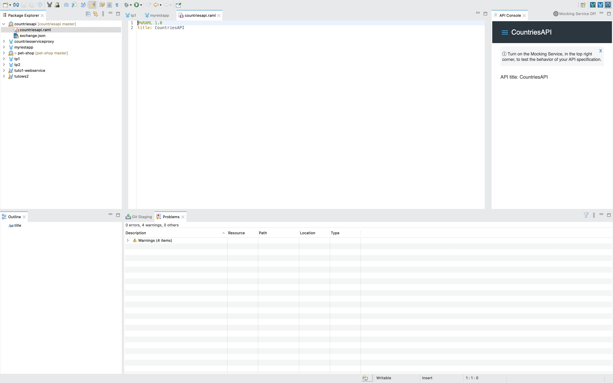

## Création d’un document RAML
Dans ce qui suit, nous vous indiquons les étapes nécessaires pour créer un simple fichier RAML décrivant une API REST répondant aux recommandations de bonne conception d'API REST.

###  Création d’une API RAML
Remplir le fichier _countriesapi.raml_ créé pour qu'il ressemble à ce qui suit:

``` yaml
#%RAML 1.0
title: Countries
version: v1
baseUri: /countries

/countries:
  get:
    responses:
      200:
        body:
          application/json:
            properties:
              name: string
              population: number
              capital: string
              currency: string
  post:
    body:
      application/json:
        properties:
            name: string
            population: number
            capital: string
            currency: string
  /{id}:
    delete:
      responses:
        204:
    put:
      body:
        application/json:
          properties:
            name: string
            population: number
            capital: string
            currency: string
```
!!!warning "Attention!"
    Prenez soin de respecter les tabulations et les retraits de ligne!


Dans cette description, nous définissons le comportement principal de l'API, à l'appel des quatre méthodes les plus fréquentes: un *GET* ou un *POST* sur la ressource principale, et un *DELETE* ou un *PUT* sur un objet particulier représenté par son *id*.

### Définir des types
Pour éviter les redondances constatées dans notre définition, nous créons le type *Country*. Pour cela:

  * Dans une nouvelle ligne au dessus de */countries*, taper les lignes suivantes:

```yaml
types:
  Country:
    properties:
      name: string
      population: number
      capital: string
      currency: string
```

  * Définir *Country* comme type pour le corps de la méthode *post*, en écrivant: **type: Country** au dessous de *application/json* de la méthode post
  * Ajouter de même *Country* comme type pour la méthode put, et *Country[]* pour la méthode get.

### Extraction d’un type de ressources
Pour générer un type de ressources à partir d’une ressource existante:

  * Ajouter le code suivant au dessus du *title*:

```yaml
resourceTypes:
  Collection:
    get:
      responses:
        200:
          body:
            application/json:
              type: Country[]
    post:
      body:
        application/json:
          type: Country
  Member:
    delete:
      responses:
        204:
    put:
      body:
        application/json:
          type: Country
```

  * Supprimer le contenu de /countries et de /{id} pour le remplacer par les nouveaux resourceTypes définis en utilisant: **type: Collection** et **type: Member**.

### Ajout de paramètres au type de ressource
Pour rendre le type de ressource créé générique, il serait plus intéressant de paramétrer le type de réponse. Pour cela:

  * Remplacer le terme *Country* dans *Collection* et *Member* par ``` <<item>> ```.
  * Remplacer les ressources *Collection* et *Member* respectivement par ```{ Collection: {item : Country} }``` et ```{ Member: {item : Country} }```

### Ajout d’un exemple
Pour ajouter un exemple de pays, modifier le type *Country* pour qu’il soit comme suit:

```properties
types:
  Country:
    properties:
      name: string
      population: number
      capital: string
      currency: string
    example:
      name: Spain
      population: 46704314
      capital: Madrid
      currency: EUR
```


### Création du service REST avec APIKit
APIKit est un toolkit open source spécialement créé pour faciliter l’implémentation d’APIs REST, en renforçant les bonnes pratiques de création d’APIs.

Nous allons commencer par implémenter l'API REST que nous venons de créer avec RAML de faon statique, puis en faisant appel au service SOAP créé dans le TP précédent. 


#### *Création du projet REST dans Mule*
Créer un nouveau Mule Project qu’on appellera *CountriesRESTService*:

  * Choisir comme environnement d’exécution Mule Server.
  * Cliquer sur l'onglet **Import RAML from local file** et choisir le fichier _countriesapi.raml_ créé dans la première partie du TP.

Un nouveau projet sera créé avec le fichiers *countriesapi.raml*  sous le répertoire *src/main/resources/api*, ainsi que des flux de gestion des différentes méthodes ajoutées par défaut dans le canevas. Vous retrouverez notamment:

|Flux|Description|Figure|
|---------|------------------------------------------------|-------------|
| countriesapi-main | Flux principal, définissant un point d’accès HTTP, un routeur APIKit et une référence à une stratégie d'exception   | 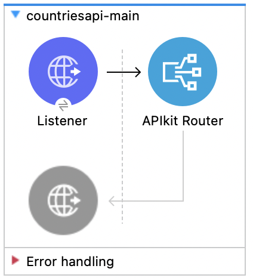|
| action:/ressource:api-config | Un Backend flow pour chaque paire de ressource/action dans le fichier RAML. Par exemple, *get:/products:api-config* représente l’action *get* de la ressource *products*   | 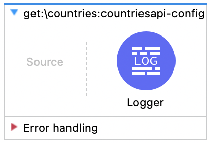|

#### *Configuration du flux principal*

  * Dans les propriétés du composant Listener du flux principal (*countriesapi-main*), on peut constater que le chemin principal de l'api, représenté par le Path, est : _/api/*_.
  * Dans le *Connector Configuration*, cliquer sur l'icône , modifier le port en 8088 pour éviter les conflits futurs avec le service SOAP du TP précédent, puis cliquer sur *OK*.


Lancer le projet comme *Mule Application*. 

Pour commencer, afficher la documentation de l'API dans une *APIKit Console*. Pour cela:
  
  * Aller à *Window -> Show View -> Other...*
  * Choisir *APIKit View -> APIKit Consoles*

Une vue va s'afficher comme suit (regardez à gauche de l'écran):

<center>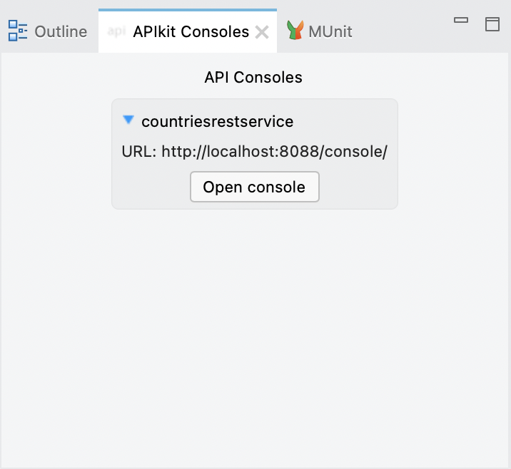</center>

Cliquer sur *Open Console*. Une fenêtre va s'afficher sur votre navigateur, comme suit:


<center>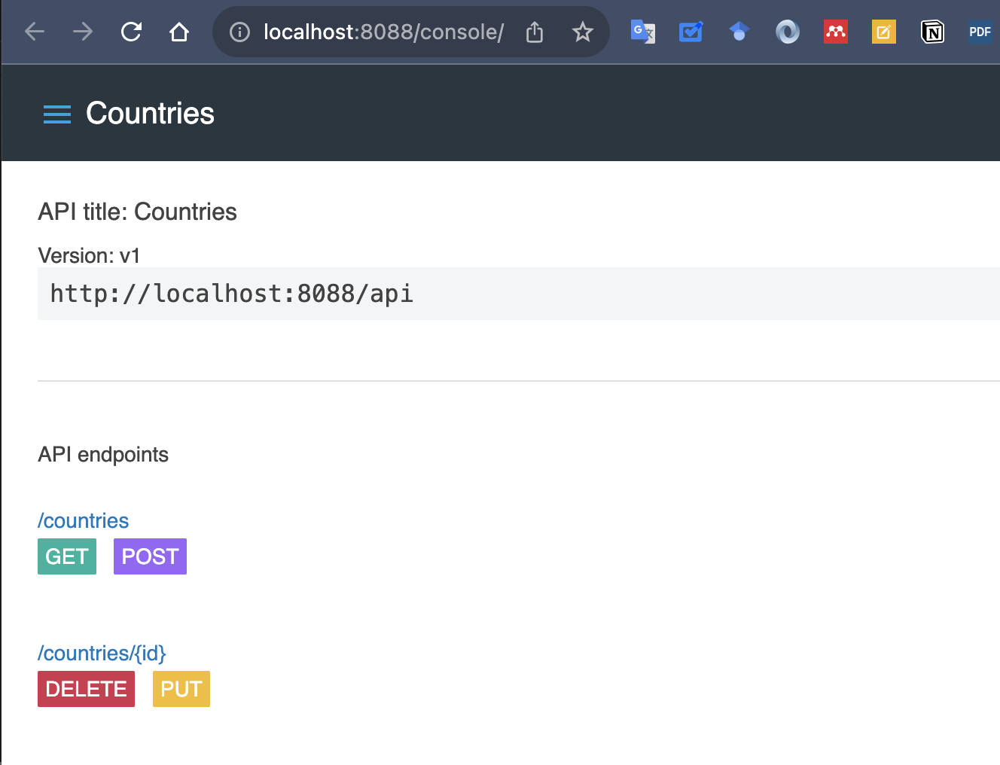</center>

Pour consulter votre API, cliquer par exemple sur le bouton *GET* de la ressource */countries*. La console affichera alors la réponse, qui a été définie comme exemple dans le fichier RAML de départ.

<center>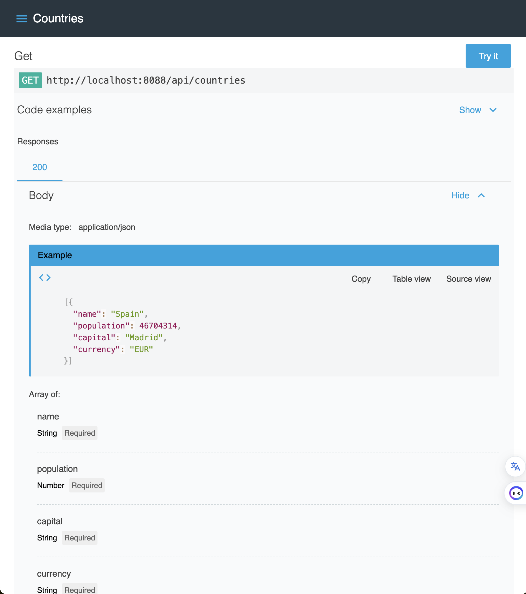</center>

#### *Implémentation du service statiquement dans Mule*
Nous allons implémenter la méthode *get* du service pour qu'elle extrait les données à partir de la base de données MySQL *Countries* créée dans le TP précédent. Pour cela, reconstruire le flux *get:\countries* de façon à obtenir le résultat suivant:

<center>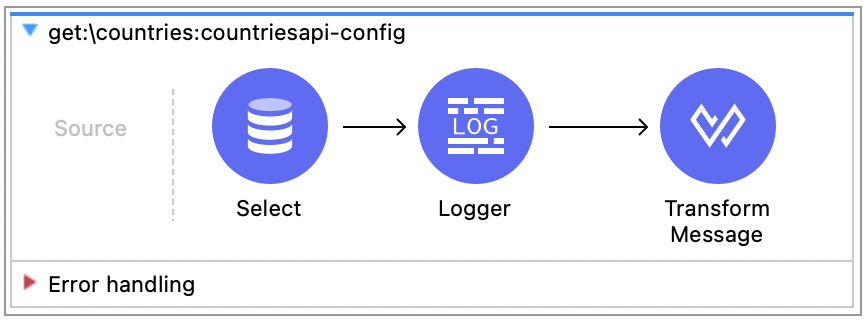</center>

Pour tester que votre requête fonctionne bien, il suffit de taper le chemin suivant sur votre navigateur (ou tout autre outil de test REST: `http://localhost:8088/api/countries`. Si tout se passe bien, le résultat devrait ressembler à ce qui suit:

```json
[
  {
    capital: "Yerevan",
    name: "Armenia",
    currency: "AMD",
    population: 3000000
  },
  {
    capital: "Berlin",
    name: "Germany",
    currency: "EUR",
    population: 83000000
  },
  {
    capital: "Warsaw",
    name: "Poland",
    currency: "PLN",
    population: 38000000
  },
  {
    capital: "Moscow",
    name: "Russia",
    currency: "RUB",
    population: 145000000
  },
  {
    capital: "Madrid",
    name: "Spain",
    currency: "EUR",
    population: 47420000
  },
  {
    capital: "Tunis",
    name: "Tunisia",
    currency: "TND",
    population: 12260000
  }
]
```


### Appel au service SOAP du TP1 à partir de l'API REST
L'une des grandes utilités d'un ESB est d'intégrer les services existants qui utilisent parfois des protocoles ou technologies différentes. Nous allons montrer comment on pourra, avec notre service REST, faire appel à un service SOAP. 

On rappelle que le service SOAP créé précédemment, prend en entrée le nom d'un pays (paramètre _name_ de type chaîne de caractères), et retourne une SOAP Response avec les informations relatives à ce pays, extraites de la base de données _countries_.

#### *Modifier le RAML initial*
Nous devons modifier le fichier RAML initial de façon à exposer une méthode **get** qui prend en entrée un nom de pays. Pour cela:

1. Ouvrir le fichier RAML dans le projet *countriesrestservice* (vous le trouverez sous *src/main/resources/api*), et ajouter, sous *Member*, l'élément suivant:
```yaml
 get:
  responses:
    200:
      body:
        application/json:
          type: <<item>>
```
2. Pour recharger le nouveau fichier et générer le flux que nous venons de créer, faire un clic-droit sur le projet, et choisir **Mule -> Generate Flows from Local REST API**. Vous remarquerez que le flux suivant vient d'être ajouté: 
<center>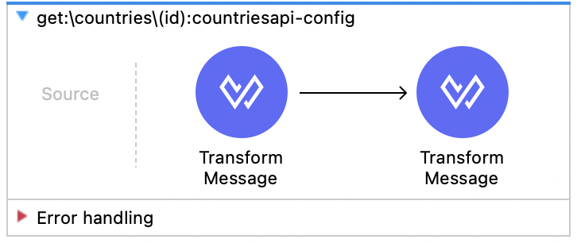</center>

3. Nous commencerons par tester ce service. Pour cela, dans le second *Transform Message*, glisser-déplacer la variable **id** vers la sortie **name**, comme suit:
<center>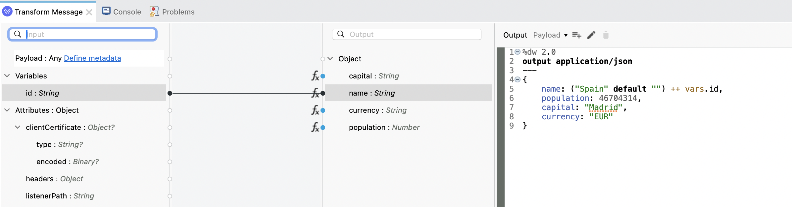</center>

4. Relancer ce service, et observer le résultat en tapant le chemin `http://localhost:8088/api/countries/Dorne`. L'affichage est bien sûr incongru, mais ça fonctionne s'il vous donne ça:

```json
{
  name: "SpainDorne",
  population: 46704314,
  capital: "Madrid",
  currency: "EUR"
}
```

#### *Appeler le service SOAP*

Pour appeler votre service SOAP, modifier le flux de la requête *get:\countries\(id)* comme suit:

1. Supprimer tous les composants déjà existants.
2. Ajouter le composant **Web Service Consumer**.
3. Le configurer comme suit:
    - Devant *Connector configuration*, cliquer sur  pour ajouter une nouvelle configuration.
    - Coller le chemin du WSDL de votre service SOAP dans _WSDL Location_ (si vous n'avez rien changé, cela devrait être `http://localhost:8081/CountriesPortService/CountriesPortSoap11?wsdl`) 
    - Cliquer sur OK pour valider. Les valeurs suivantes devraient s'afficher :
        * **Service**: CountriesPortService
        * **Port**: CountriesPortSoap11
        * **Address**: http://localhost:8081/CountriesPortService/CountriesPortSoap11
     * Une fois cette fenêtre fermée, sélectionner (si ce n'est déjà fait) _getCountry_ dans Operation. 
     * Dans la partie Body, cliquer sur le bouton pour mapper l'entrée du service REST à celui du service SOAP. Glisser-déplacer ensuite la variable _id_ se trouvant sous _Attributes -> uriParams_ de la fenêtre de gauche, vers la variable _name_ se trouvant sous *getCountryRequest* de la fenêtre de droite. Le code suivant devrait se générer :
```properties
output application/xml
ns ns0 http://spring.io/guides/gs-producing-web-service
---
{
	ns0#getCountryRequest: {
		ns0#name: attributes.uriParams.id
	}
}
```

4. Ajouter maintenant le composant **Transform Message** pour transformer la réponse SOAP reçue en JSON.
5. Glisser-déplacer les champs provenant du payload _getCountryResponse_ vers l'objet en sortie. Cela devra générer le code suivant:
```properties
%dw 2.0
output application/json
ns ns0 http://spring.io/guides/gs-producing-web-service
---
{
	capital: payload.body.ns0#getCountryResponse.ns0#country.ns0#capital default "",
	name: payload.body.ns0#getCountryResponse.ns0#country.ns0#name default "",
	currency: payload.body.ns0#getCountryResponse.ns0#country.ns0#currency default "",
	population: payload.body.ns0#getCountryResponse.ns0#country.ns0#population default 0
}
```
#### *Lancer les services*

Pour exécuter les deux services dans Anypoint, il faut suivre les étapes suivantes:

* Créer une nouvelle configuration d'exécution (_Run Configurations..._) qu'on appellera **services1and2**
* Sélectionner les deux services *tp1* et *countriesrestservice*. Cela devra ressembler à ce qui suit:
<center>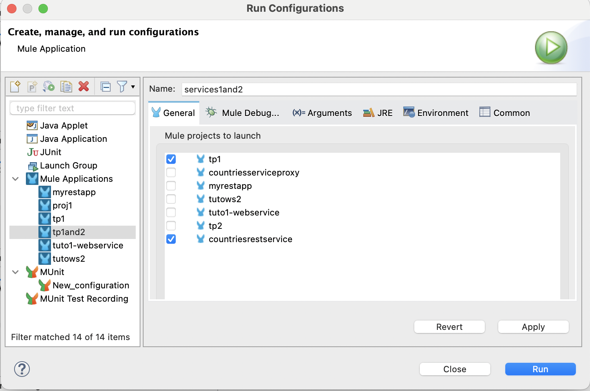</center>

* Lancer les deux services en cliquant sur _Run_.

Une fois les deux services lancés, tester la nouvelle fonctionnalité implémentée, en allant sur le navigateur et en testant par exemple: `http://localhost:8088/api/countries/Armenia`. Le résultat affiché sera ainsi:

<center>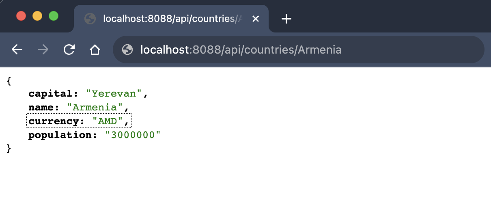</center>


# Homework

!!! note "Projet E2"
    Pour la séance de TP prochaine, vous devez réaliser l'étape 2 du projet, qui consiste à:
    
    * Terminer les diagrammes de votre entreprise commencés la semaine d'avant.
    * Concevoir et commencer l'implémentation des services nécessaires pour votre PoC. 
    * Réfléchir à l'usage des ESB, leur rôle et les stratégies qui y seront implémentées.