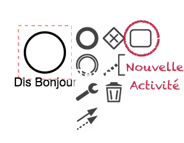
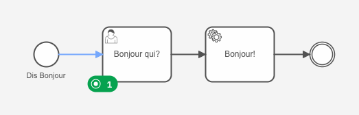

# Télécharger PDF
[](tp3.pdf)

# Objectifs du TP
Création d'un processus métier (Business Process) en utilisant Camunda.

# Outils et Versions
Pour ce TP, nous allons utiliser **la version SaaS de Camunda et Camunda Modeler**:

* [Camunda](https://camunda.org/) - Version *latest*
* [VsCode](https://code.visualstudio.com/) - Version *latest* (ou tout autre IDE de votre choix)
* [Java](https://www.java.com/) - Version 17 ou plus.
 
# Camunda [](https://camunda.org)
Camunda est une plateforme open source pour la gestion des processus métier. C'est un framework Java qui support **BPMN** pour l'automatisation des processus, **CMMN** pour le Case Management, et **DMN** pour le Business Decision Management.


# BPMN 2.0 [](http://www.bpmn.org/)
BPMN 2.0 (Business Process Modeling Notation) est un standard développé par le Object Management Group (**OMG**) pour fournir une notation facilement compréhensible par tous les utilisateurs métier: les analystes métier, les développeurs implémentant les technologies exécutant ces processus et les personnes gérant et supervisant ces processus. BPMN permet d'établir un pont minimisant le gap entre les conceptions des processus et leurs implémentations.

Dans sa première version, la spécification BPMN permettait de fournir uniquement une notation graphique, et est devenue rapidement célèbre parmi les analystes métier. Elle définissait la manière dont les concepts tels que les tâches humaines et les scripts exécutables, pouvaient être visualisées de manière standard, indépendante d'un constructeur particulier.

Cette deuxième version étend ce standard en incluant des sémantiques d'exécution et un format d'échange commun. Ce qui veut dire que les modèles de processus BPMN 2.0 peuvent être échangés entre des éditeurs graphiques différents, et exécutés sur n'importe quel moteur compatible avec BPMN 2.0, tel que Camunda et Activiti.


# Mise en marche
Pour les besoins de ce TP, créer d'abord un compte sur [Camunda](https://camunda.org). Une fois c'est fait, suivre les étapes pour créer un cluster temporaire. Vous vous retrouverez dans la fenêtre Console, qui ressemble à ce qui suit:


# Premier Projet Camunda BPMN

## Modélisation du processus Helloworld
Nous allons utiliser le Web Modeler pour concevoir un diagramme BPMN. Pour cela:

* Cliquer sur le bouton carré se trouvant en haut à gauche de la fenêtre (). Choisir ensuite **Modeler** puis cliquer sur **New Project**.
* Appeler le projet *Helloworld*, ensuite cliquer sur **Create New File** -> **BPMN Diagram**.
* Appeler le diagramme *HelloworldDiagram*, puis aller dans, propriétés du diagramme, sous l'onglet **General**, définir:
    * *Name*: Helloworld
    * *ID*: ProcessHW
* Double-cliquer sur l'évènement de départ (le petit rond) pour modifier son nom. Nous l'appelerons *Dis Bonjour*.
* Cliquer sur l'évènement de départ, choisir le rectangle (représentant une activité) à partir du menu contextuel qui apparaît, et le glisser vers un emplacement adéquat. Nous appellerons le nouvel évènement inséré *Ajouter Bonjour*.

<center></center>

* Cette tâche sera celle où l'utilisateur va indiquer son nom pour l'éternel **Bonjour <nom\>!**. Pour cela, nous devons indiquer que le traitement fait ici sera réalisé par un humain. Pour cela, en cliquant sur l'activité créée, cliquer dans le menu contextuel sur la clef à molette, puis choisir *User Task*. On l'appellera *Bonjour qui?*

<center></center>

* Rajouter une tâche de fin au processus.


Nous obtenons pour finir le diagramme suivant:

<center></center>

## Premier déploiement et test

Pour déployer votre processus, il suffit de cliquer sur **Deploy**. Le processus Helloworld sera déployé sur le cluster nouvellement créé.

Pour exécuter le processus:

* Cliquer sur **Run**. 
* Pour voir l'état du processus en cours:
    * Cliquer sur le bouton (), puis sur **Operate**. Cliquer sur l'instance active Helloworld.
    * Dans Operate, vous verrez une visualisation de l'instance du processus en cours. Remarquez qu'un jeton vert est en attente à la tâche de l'utilisateur. Cela signifie qu'une tâche attend d'être traitée dans la liste des tâches.
* Pour exécuter le processus:
    * Cliquer encore une fois sur (), puis sur **Tasklist**. Cliquer ensuite sur *Bonjour qui?*.
    * La tâche n'étant actuellement affectée à aucun utilisateur, vous verrez *Unassigned* à côté du bon de la tâche.
    * Cliquer sur *Assign to me*.
    * Cliquer ensuite sur *Complete Task*. Nous n'avions de toute façon rien d'autre à faire. 
    * La tâche passera à l'état *Completed*, et on verra dans la fenêtre *Operate* que le marqueur vert a disparu. 


## Création d'un formulaire personnalisé
Pour créer votre propre formulaire, avec des variables en entrée qui peuvent être manipulées par le service,  suivre les étapes suivantes:

  * Revenir vers le Modeler, et cliquer sur la tâche utilisateur *Bonjour qui?*.
  * Cliquer sur le bouton bleu qui apparaît, puis sur *Create new form*, comme indiqué dans la fenêtre suivante:
  <center></center>
  * Ajouter dans le générateur de formulaire un champs de type *Text Area*. Changer son label pour **Nom** et sa clef pour **nom**. Cette clef représentera une variable de processus, veiller à ce qu'elle soit unique.

Une fois le fomulaire créé, il faut l'assosier à la tâche.

  * Revenir vers le diagramme en cliquant sur *Helloworld* dans l'historique de navigation en haut de la fenêtre, puis en revenant vers le *Helloworld Diagram*.
  * Refaire les mêmes étapes en cliquant sur la tâche *Bonjour qui?*, sur le bouton de formulaire, mais en choisissant maintenant le nouveau formulaire créé qui s'appelle aussi *Bonjour qui?*.
  <center></center>

Testons maintenant que ce formulaire marche bien. Pour cela, redéployer le processus puis l'exécuter. Vous verrez cette fois la variable *nom* dans la liste des variables.

Une fois le processus affecté à vous, définir la valeur de nom, puis cliquer sur *Complete Task*. Rien ne se passera, car on n'a pas dit ce qu'on devait faire avec cette nouvelle entrée. Nous allons le faire dans la partie suivante.

## Création d'un Service Task avec un connecteur Java
La fameuse salutation *Hello <name>!* sera réalisée par une nouvelle tâche de type **Service Task**. Pour la définir:

  * Insérer une tâche *Bonjour!* de type **Service Task** entre *Bonjour qui?* et la tâche de fin.
  * Pour la configurer, il faut:
      *  Lui donner un type: c'est une chaîne de caractères permettant d'identifier la tâche de faon unique, et de lui associer le traitement à faire, plus tard dans le code. Nous allons définir comme type: *hello*.
      *  Ajouter dans la partie Headers l'élément suivant, qui indique que la sortie de cette tâche sera contenue dans une variable *greeting*:
         *  Key: *resultVariable*
         *  Value: *greeting*
  
Nous allons maintenant créer un connecteur de type Spring app, dont le but est de définir le comportement de la tâche. Cela va de soi que ce que nous présentons ici est une version simplifiée de ce qui pourra être plus tard, un comportement bien plus complexe du processus.

Nous allons pour réaliser ce service adapter un code fourni par Camunda. Je me suis inspirée dans cette partie de leur [tutoriel vidéo](https://www.youtube.com/watch?v=wG6sqmMUo30).

  * Cloner le projet Git suivant: https://github.com/camunda/connector-template-outbound/
  * Ce projet définit principalement 5 fichiers importants:
    * La classe **MyConnectorRequest**: représente le format de l'input de la *Service Task* qu'on essaie d'implémenter. Dans le projet initial, cet input définit deux variables: message (de type texte) et authentication (de type map, contenant deux élements: un user et un token). Il faut modifier cette requête pour qu'elle accepte uniquement une entrée de type texte, appelée **nom**.
    * La classe **MyConnectorResult**, qui définit le format de la sortie de la tâche. Cette sortie est une chaîne de caractères *myProperty*, nous allons la garder telle qu'elle est.
    * La classe **MyConnectorFunction**, qui décrit:
        * Le connecteur dans l'annotation *@OutboundConnector*. Nous devons le modifier de façon à ce qu'il accepte comme entrée un seul élement *nom*, et que le type soit *"hello"*: c'est le même type que nous avons associé à la tâche dans le modeler.
        * La méthode *executeConnector* qui définit le comportement du connecteur. Nous aimerions juste qu'il sauvegarde l'input *nom* trouvé dans la requête dans une variable, puis qu'il donne en sortie: *"Bonjour <nom\>!"*
  
    * La classe **LocalConnectorRuntime** sous le répertoire *test*:
        * Cette classe permet de lancer la tâche. 
        * Il est recommandé de **supprimer les autres classes de test** pour éviter les erreurs. Elles nous sont inutiles pour le moment.
  * Le fichier **application.properties** sous le répertoire *test*
        * Ce fichier contient les informations de connexion au cluster Camunda.
        * Il faut supprimer le contenu de ce fichier, et garder uniquement la ligne ``` camunda.connector.polling.enabled=false```. Nous allons le remplir avec les informations nécessaires plus tard.

Une fois les modifications apportées au code, nous allons ajouter les informations de connexion au cluster. Pour cela:

  * Dans Camunda Console, dans les informations de votre cluster, cliquer sur l'onglet *API*.

 
 
  * Créer une nouvelle API. Lui donner un nom de votre choix, et garder les autres config telles qu'elles.
  * Copier et télécharger les informations données sous l'onglet *Spring Boot*.
  * Coller ces données dans le fichier *application.properties*.

Exécuter votre connecteur en lançant la classe *LocalConnectorRuntime*. Vérifier bien que la sortie ressemble à ce qui suit:


Nous allons maintenant le tester. Lancer le votre processus et observer son avancement dans la page Operate. 

  * Le processus commence par attendre l'input de l'utilisateur dans la tâche *Bonjour qui?*:



  * Ouvrir la fenêtre *Tasklist* et lancer le processus. Saisir votre nom dans le champ *Nom*:


  * Revenir à la fenêtre *Operate*. Si tout se passe bien, le processus aura été achevé, et une nouvelle variable apparaît: *greeting*, avec la valeur : *Bonjour <votre_nom\>!*


<!--###################################-->
# Homework

!!! note "Projet E3"
    Pour la séance de TP prochaine, vous devez réaliser l'étape 3 du projet, qui consiste à:
    
    * Concevoir et implémenter les processus métiers choisis de votre entreprise, avec Camunda ou tout autre outil BPM de votre choix.
    * Commencer l'implémentation et configuration de votre ESB, pour permettre la communication entre les services, processus métiers et clients. 
