# Télécharger PDF
[](tp4.pdf)

# Objectifs du TP
1. Génération d’API avec Anypoint API Designer et le langage RAML
2. Gestion des APIs avec Anypoint Studio et le API Gateway de Mulesoft

# Outils et Versions
* [Anypoint Studio](https://www.mulesoft.com/platform/studio) Version: 7.14.0
* [MySQL](https://dev.mysql.com/downloads/mysql/) ou tout autre SGBD de votre choix
* _Dans ce TP, nous aurons besoin du service créé dans le [TP1](tp1.md#service-web-rest--interrogation-dune-base-de-données), ou bien de n'importe quel service REST de votre choix_

# API Management avec Anypoint Studio

[Anypoint](https://www.mulesoft.com/platform/enterprise-integration) est une plateforme développée par l’entreprise Mulesoft qui offre les outils nécessaires pour la gestion d’APIs. Grâce à Anypoint, Mulesoft est classée par Gartner dans son Magic Quadrant dans la rubrique “Full Life Cycle API Management” de Septembre 2021 parmi les leaders du marché du API Management.


# Génération d'API avec RAML
## RAML
[RAML](https://raml.org/) (RESTful API Modeling Language) est un langage pour la définition d’API HTTP qui satisfont les exigences de l'architecture REST. La spécification RAML est une application de la spécification YAML, qui fournit des mécanismes pour la définition d’APIs RESTful.

RAML est développé et supporté par un groupe de leaders en nouvelles technologies, provenant de plusieurs entreprises éminentes (Mulesoft, Airware, Akana, VMware, CISCO…). Leur but est de construire une spécification ouverte, simple et succincte pour la description d’APIs. Ce groupe de travail contribue à la fois à la spécification RAML, ainsi qu’à un écosystème croissant d’outils autours de ce langage.

## Génération de l'API RAML avec AnyPoint API Designer
Pour écrire un document RAML de manière simple et intuitive, ouvrir Anypoint Studio, et créer un nouveau projet de type **"API Specification Project"**, intitulé *Pet Shop* de type *RAML 1.0*. L'interface suivante devra s'afficher:

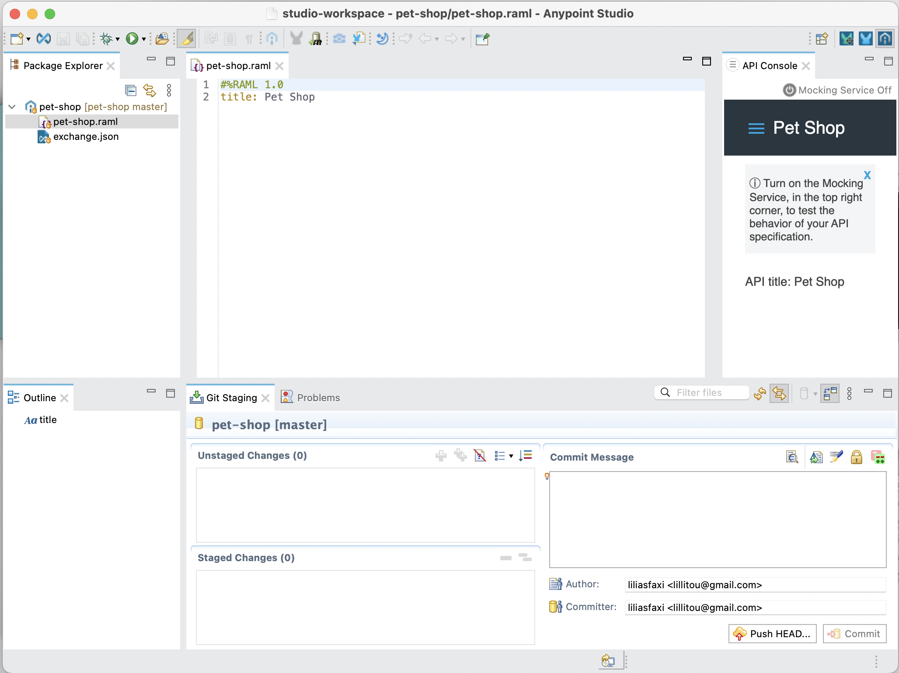

## Création d’un document RAML
Dans ce qui suit, nous vous indiquons les étapes nécessaires pour créer un simple fichier RAML décrivant une API REST répondant aux recommandations décrites dans le cours.

###  Création d’une API RAML
Remplir le fichier pet-shop.raml créé pour qu'il ressemble à ce qui suit:

``` yaml
  #%RAML 1.0
  title: Pet Shop
  version: v1
  baseUri: /pets

  /pets:
    get:
      responses:
        200:
          body:
            application/json:
              properties:
                name: string
                kind: string
                price: number
    post:
      body:
        application/json:
          properties:
              name: string
              kind: string
              price: number
    /{id}:
      delete:
        responses:
          204:
      put:
        body:
          application/json:
            properties:
              name: string
              kind: string
              price: number
        
        
```
Dans cette description, nous définissons le comportement principal de l'API, à l'appel des quatre méthodes les plus fréquentes: un *GET* ou un *POST* sur la ressource principale, et un *DELETE* ou un *PUT* sur un objet particulier représenté par son *id*.


### Définir des types
Pour éviter les redondances constatées dans notre définition, nous créons le type *Pet*. Pour cela:

  * Dans une nouvelle ligne au dessus de */pets*, taper les lignes suivantes:

```yaml
types:
  Pet:
    properties:
      name: string
      kind: string
      price: number
```

  * Définir *Pet* comme type pour le corps de la méthode *post*, en écrivant: *type: Pet* au dessous de *application/json* de la méthode post
  * Ajouter de même *Pet* comme type pour la méthode put, et *Pet[]* pour la méthode get.

### Extraction d’un type de ressources
Pour générer un type de ressources à partir d’une ressource existante:

  * Ajouter le code suivant au dessus du *title*:

```yaml
resourceTypes:
  Collection:
    get:
      responses:
        200:
          body:
            application/json:
              type: Pet[]
    post:
      body:
        application/json:
          type: Pet
  Member:
    delete:
      responses:
        204:
    put:
      body:
        application/json:
          type: Pet
```

  * Supprimer le contenu de /pets et de /{id} pour le remplacer par les nouveaux resourceTypes défini en utilisant: **type: Collection** et **type: Member**.

### Ajout de paramètres au type de ressource
Pour rendre le type de ressource créé générique, il serait plus intéressant de paramétrer le type de réponse. Pour cela:

  * Remplacer le terme *Pet* dans *Collection* et *Member* par ``` <<item>> ```.
  * Corriger les erreurs qui s’affichent dans les ressources *Collection* et *Member* respectivement par ```{ Collection: {item : Pet} }``` et ```{ Member: {item : Pet} }```

### Ajout d’un exemple
Pour ajouter un exemple d’animal, modifier le type *Pet* pour qu’il soit comme suit:

```properties
types:
  Pet:
    properties:
      name: string
      kind: string
      price: number
    example:
      name: Snoopy
      kind: Dog
      price: 1000
```

### Définir des paramètres pour les méthodes
Nous nous proposons d’ajouter une autre méthode de type *get*, qui définit plusieurs paramètres. Pour cela, 

  * Sous (et au même niveau que) *type* de */pets*, taper: *get:*
  * Ajouter le code suivant: 
```yaml
get:
    queryParameters:
      priceLessThan: number
      priceMoreThan: number
      petKind:
        enum:
          - bird
          - dog
```

Il est possible d’extraire certains des paramètres comme *Trait*, c’est à dire un critère de filtrage. Pour cela, ajouter le code suivant au dessus de *resourceTypes*:

```yaml
traits:
  FiltrableByPrice:
    queryParameters:
      priceLessThan: number
      priceMoreThan: number
```


### Première Application
Dans Anypoint Studio, créer un nouveau Mule Project: 

  * Appeler le projet *MaPremiereApp*
  * Choisir Mule Server comme *Runtime Environment*.
  * Cliquer sur *Finish*.

Nous allons commencer par créer une simple application qui affiche un message.

  * À partir de la palette, glisser-déplacer les éléments graphiques suivants dans le canevas:
    - **HTTP Listener**: permet de se connecter aux ressources web via HTTP ou HTTPS.
    - **Set Payload**: modifie le message affiché (payload) en "Hello World!".

Votre flux aura l’allure suivante:

<center>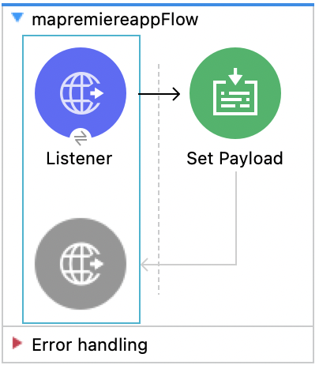</center>

Configurer votre composant Listener :

  * Ajouter une nouvelle *Connector Configuration*
  * Garder les options par défaut. Votre hôte se lancera à l’URL 0.0.0.0:8081
  * Définir le path comme **/hello** (ceci représente le chemin relatif à partir du chemin de base défini dans la configuration du listener).

Configurer le composant Set Payload:

  * Remplacer la valeur de l’élément *Value* par *Hello World!!*
  * Lancer votre application : Run -> Run As -> Mule Application. La console devrait afficher un message comme suit:

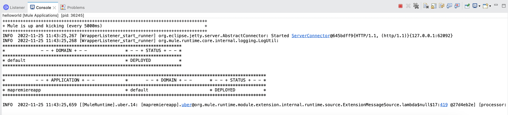

Dans un navigateur, taper l'adresse: _0.0.0.0:8081/hello_. Un fichier contenant le message _Hello World!_ devra être disponible.

### Gestion des APIs avec APIKit
APIKit est un toolkit open source spécialement créé pour faciliter l’implémentation d’APIs REST, en renforçant les bonnes pratiques de création d’APIs.

Nous allons pour cela exposer l'API REST que nous avons créé avec Talend dans la deuxième partie du [TP1](tp1.md#service-web-rest--interrogation-dune-base-de-données).

#### *Création d'un fichier RAML pour le service*
Pour représenter le service "Get Users", créer le fichier *usersapi.raml* suivant dans API Designer:

```yaml
#%RAML 1.0
title: My-API
version: v1
baseUri: http://localhost:8081
/users:
  get:
    description: List of all the users
    responses:
      200:
        body:
          application/xml:
            example: !include users-example.xml

```

Rajouter également (dans le même répertoire) un fichier *users-example.xml*, où vous allez trouver un exemple de users, tel qu'ils sont représentés par votre service sur ```http://localhost:8088/users```. Cela devrait ressembler à ce qui suit:

```XML
  <users>
    <user id="11">
      <firstname>Flen</firstname>
      <lastname>Fouleni</lastname>
    </user>
    <user id="22">
      <firstname>Flena</firstname>
      <lastname>Flenia</lastname>
    </user>
  </users>
```


#### *Nouveau Projet de API Management*
Créer un nouveau Mule Project qu’on appellera *API_Project*:

  * Choisir comme environnement d’exécution Mule Server.
  * Cliquer sur l'onglet **Import RAML from local file** et choisir le fichier _usersapi.raml_ que vous venez de créer.

Un nouveau projet sera créé avec les fichiers *usersapi.raml* et *users-example.xml* ajoutés sous le répertoire *src/main/resources/api*, ainsi que des flux de gestion des différentes méthodes ajoutées par défaut dans le canevas. Vous retrouverez notamment:

|Flux|Description|Figure|
|---------|------------------------------------------------|-------------|
| usersapi-main | Flux principal, définissant un point d’accès HTTP, un routeur APIKit et une référence à une stratégie d'exception   | 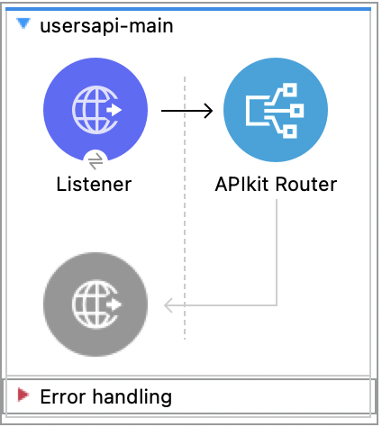|
| action:/ressource:api-config | Un Backend flow pour chaque paire de ressource/action dans le fichier RAML. Par exemple, get:/products:api-config représente l’action get de la ressource products   | 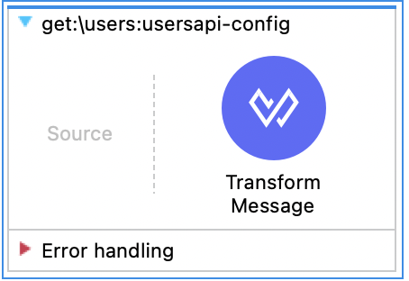|

#### *Configuration du flux principal*

  * Dans les propriétés du composant Listener, définir le Path comme: _/*_.
  * Dans le *Connector Configuration*, cliquer sur l'icône , puis cliquer sur *OK* pour valider le host (0.0.0.0) et le port (8081)

!!!note "Remarque"
    Vous pouvez changer ici le port défini par défaut, pour éviter les conflits potentiels avec d'autres services.

Lancer le projet comme *Mule Application*. 

Pour commencer, afficher la documentation de l'API dans une *APIKit Console*. Pour cela:
  
  * Aller à *Window -> Show View -> Other...*
  * Choisir *APIKit View -> APIKit Consoles*

Une vue va s'afficher comme suit:

<center>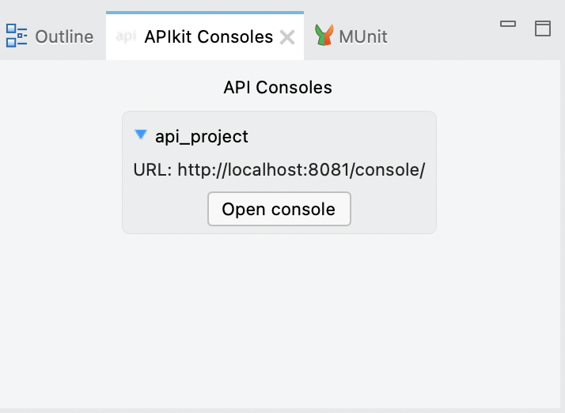</center>

Cliquer sur *Open Console*. Une fenêtre va s'afficher sur votre navigateur, comme suit:


<center>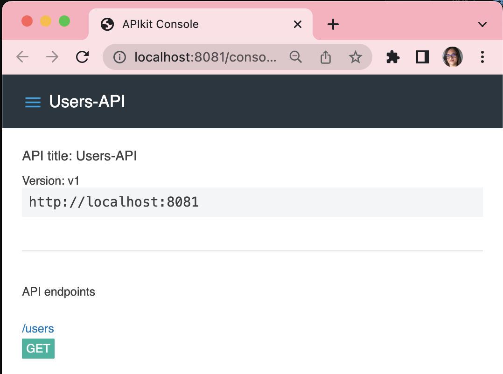</center>

Pour consulter votre API, cliquer par exemple sur le bouton *GET* de la ressource */users*. La console affichera alors la réponse, qui a été définie comme exemple dans le fichier RAML de départ.

<center>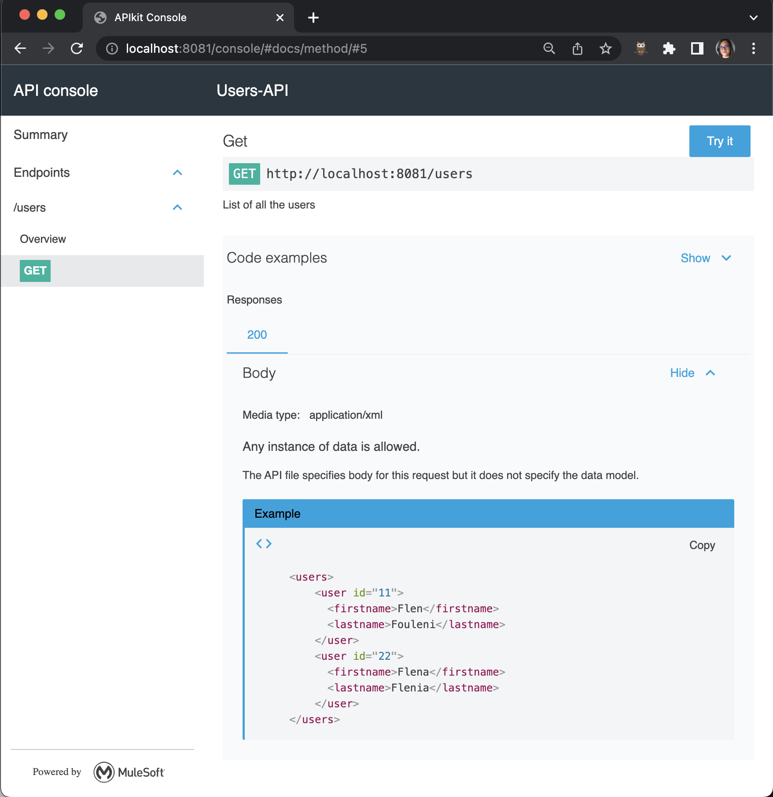</center>

Pour visualiser le résultat sur le navigateur, taper le chemin de la requête comme suit:


```URL
http://localhost:8081/users
```

Vous obtiendrez le résultat suivant:

<center>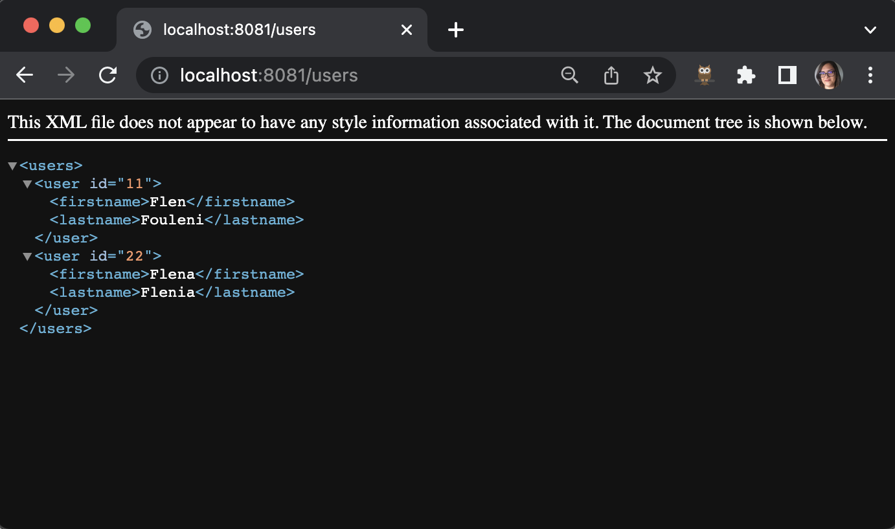</center>

### Mapping de l'API avec le service
Pour relier votre API créée avec le service du TP1 (n'oubliez pas de le lancer :wink:), qui est déployé à l'adresse suivante:

```URL
http://localhost:8088/users
```

  * Supprimer le *Transform Message* du flow : _get:/users:usersapi-config_
  * Ajouter un connecteur HTTP Listener dans la partie *Source*
  * Le configurer comme suit:
    - Path: _/all-users_
    - Cliquer sur  puis sur OK pour valider le hôte et port.
  * Ajouter un connecteur **HTTP Request** dans la partie *Process*
  * Le configurer comme suit:
    - Devant *Configuration*, cliquer sur  pour ajouter une nouvelle configuration.
    - Cela représente les informations du service auquel on va accéder. Définir le Host par *localhost*, le port par *8088*, et le base path par */*
    - Cliquer sur OK pour valider
  * Dans la partie *Request*, définir :
    - Method: Get
    - Path: /users?from=1&to=4
    - URL (_Laisser vide_)
  * Sauvegarder, et lancer le service.

Tester le service sur le navigateur avec l'URL:
``` http://localhost:8081/all-users ```. Vous obtiendrez la liste complète des utilisateurs de votre base, tels que retournés par le service initial, comme suit (le contenu exact dépend bien entendu de votre base de données):

<center>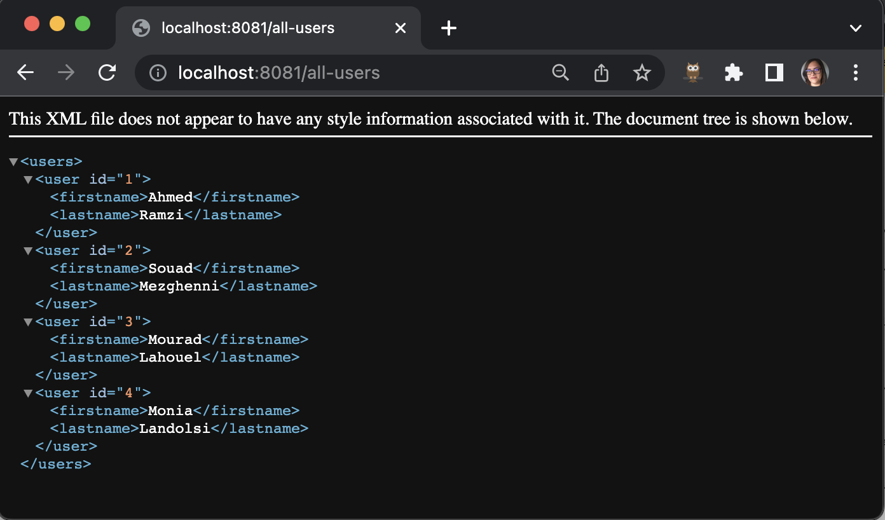</center>


### Transformation du résultat du service 
Nous allons maintenant retourner un résultat différent du service initial. Par exemple, nous allons afficher uniquement les prénoms des users, mais cette fois-ci dans un document JSON. Pour cela, utiliser un objet *Transform Message*.

  * Dans le code XML de votre **usersapi**, copier le flow get:/users pour créer un autre flow identique (modifier le nom du flow pour qu'il devienne, par exemple, _"getnames:\users:usersapi-config"_)
  * Modifier le Path du connecteur HTTP source, pour  */all-users/names*
  * Rajouter un objet *Transform Message* juste après le connecteur HTTP de droite (celui de la partie Process). Le flow devra ressembler à ce qui suit:

<center>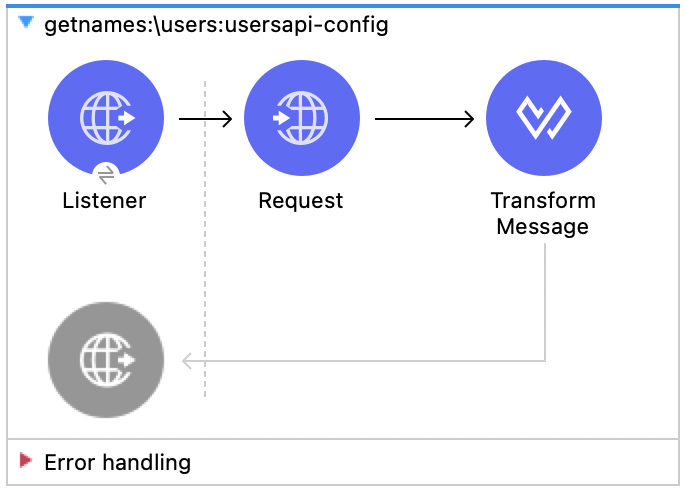</center>

  * Configurer l'objet *Transform Message*:
    - L'interface suivante représente les mappings à faire entre les entrées du service et sa sortie.

    <center>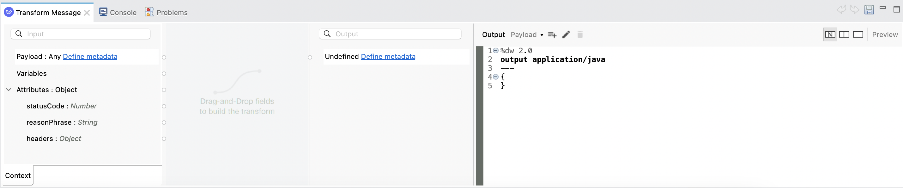</center>

    - Cliquer sur *Define Metadata* du payload en entrée (à gauche) 
    - Cliquer sur *Add*
    - Entrer le nom du type en entrée, par exemple *users*
    - Indiquer comme type *XML*
    - Indiquer dans la liste déroulante suivante que le fichier donné est un *Example*, puis choisir le fichier *users-example.xml* que vous aviez créé.
    - Cliquer sur Select. Le schéma du fichier donné est chargé dans la partie *Input* de *Transform Message*.
    - Pour représenter le format de sortie désiré, créer un fichier appelé *names.json* à l'endroit de votre préférence sur votre ordinateur.
    - Saisir le contenu suivant dans *names.json*:
    ```json
      { 
        "users": [
          {"name": "Name 1"},
          {"name": "Name 2"}
        ]
      } 
    ```
    - Cliquer sur *Define Metadata* de sortie (à droite).
    - Ajouter un nouveau type que vous appellerez *names*
    - Définir comme type *JSON* et charger le fichier *names.json* que vous venez de créer.
    - Valider.
    - Maintenant que les deux schémas (entrée et sortie) sont définis, créer les associations de votre choix. Dans notre cas, nous allons associer le champ *firstname* en entrée au champ *name* en sortie, comme suit:
    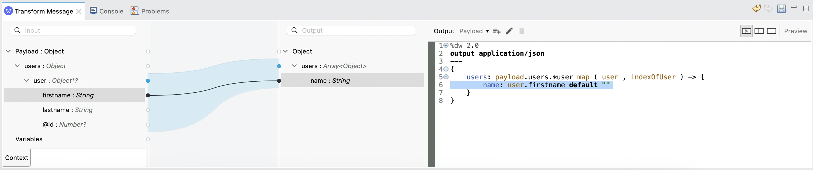
    - Sauvegarder, et lancer le service.

Pour tester le service, lancer dans un navigateur: ```http://localhost:8081/all-users/names```. Vous obtiendrez le résultat suivant:

<center>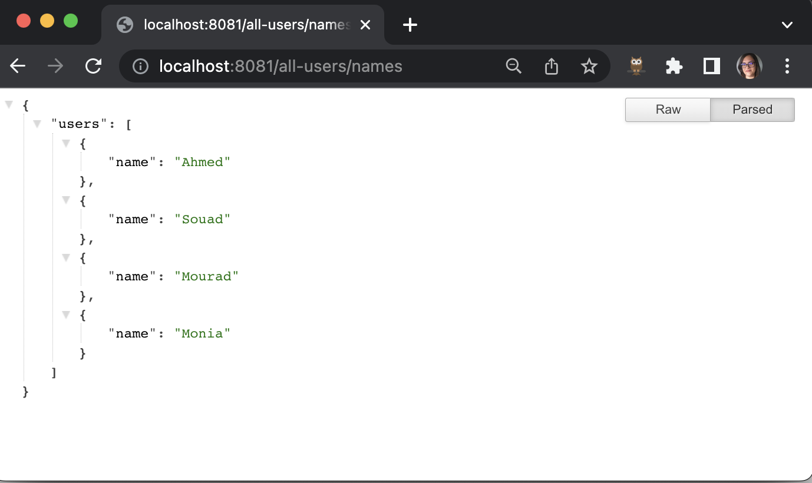</center>
