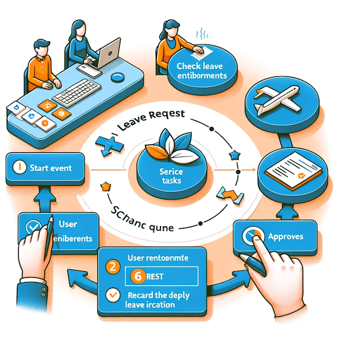

# Télécharger PDF

# Objectifs du TP
Le TP vise à intégrer MuleSoft et Camunda pour automatiser un processus métier. L'exemple choisi est un processus de demande de congé qui utilisera à la fois des services REST et SOAP.

# Outils et Versions
* [Anypoint Studio 7 and Mule ESB 4](https://www.mulesoft.com/lp/dl/anypoint-mule-studio)
* [Camunda](https://camunda.org/) - Version *latest*
* [VsCode](https://code.visualstudio.com/) - Version *latest* (ou tout autre IDE de votre choix)
* [Java](https://www.java.com/) - Version 17 ou plus.
* [SOAP UI](https://www.soapui.org/downloads/soapui.html) (Open Source) Version 5.7.0
* [MySQL](https://dev.mysql.com/downloads/) Version _latest_

# Description du Processus
Nous allons développer un processus métier permetant de simuler une demande de congé. Le processus est décrit comme suit:

  * Un employé initie une demande de congé via une interface utilisateur.
  * L'employé remplit un formulaire avec les détails de la demande (date de début, date de fin, type de congé, etc.).
  * La demande est envoyée pour approbation.
  * Un service permet de vérifier les droits de congé de l'employé (jours disponibles, types de congés autorisés, etc.).
  * Le responsable de l'employé va approuver ou refuser la demande.
  * Si la demande est approuvée: 
    * Un service est appelé pour enregistrer la décision dans le système de gestion des congés (une base de données).
    * Un autre service met à jour les informations de congé de l'employé (décompter les jours de congé, etc.).
  * L'employé est notifié de la décision (approuvée ou refusée).
  * Le processus se termine une fois la notification envoyée.

# Création et Déploiement des Services sur MuleSoft
Il vous est demandé de créer les services automatisés sur MuleSoft:

  1. **Création du service de gestion des employés**: Créer un service REST qui gère les informations des employés, implémentant les méthodes suivantes:
     * GET pour récupérer les informations des employés
     * POST pour mettre à jour les informations, telles que les jours de congé.
  2. **Création du service d'approbation de congé**: Ceci est un service SOAP, contenant :
      * Une méthode pour soumettre une demande de congé
      * Une autre méthode pour vérifier le statut de la demande.

Il faut ensuite tester les deux services avec votre outil préféré (SOAPUI et/ou Postman).

# Modélisation du processus avec Camunda Modeler
Il vous est ensuite demandé de modéliser le service métier décrit avec Camunda Modeler, en créant les formulaires associés et en configurant les différentes tâches pour qu'elles appellent les services déployés sur MuleSoft. 

 
<!--###################################-->
# Projet

!!! note "Étape 4"
    Finaliser votre projet en intégrant les différents services et processus métier avec votre ESB. Le POC devrait être exécutable et complet pour la présentation finale du projet.  

